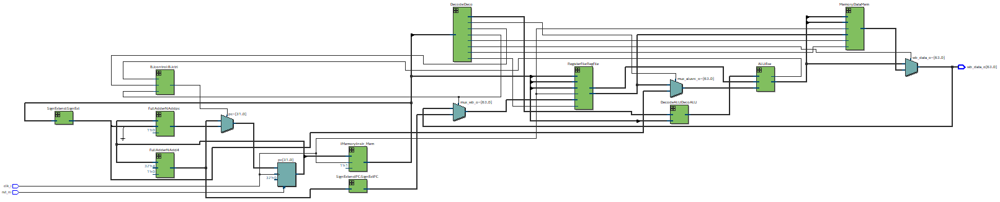
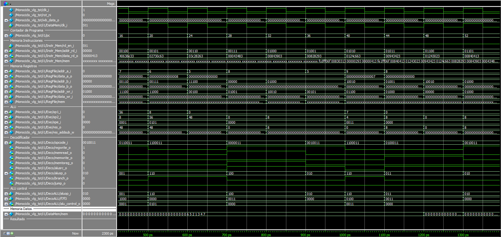

# The single-cycle processor

## Abstract
In a single-cycle processor, each instruction is executed in a single clock cycle, which means that all stages of the instruction cycle, such as instruction fetch, decoding, execution, and storing results, are completed in one clock cycle. All states are updated upon completion of the execution of an instruction. The implementation was carried out using the Quartus environment, which is a software tool produced by Altera for the analysis and synthesis of designs made in Hardware Description Languages (HDL or Hardware Description Language), which for this project Verilog was used. To simulate internal signals, the ModelSim simulator was used, which is free and distributed by Altera. Finally, the Instruction Set Architecture (ISA) used was RISC-V, because it is available under an open source license, which allows anyone to implement and manufacture RISC-V-based hardware without intellectual property restrictions, encouraging innovation and collaboration in hardware development. This project is part of the courses offered by the [Largarto Initiative](https://lagarto.ipn.mx/) of the National Polytechnic Institute (IPN).

## Tools used
- Quartus 20.1.1.
- rars 1.6.

## Programming languages
- Verilog.
- Assembly.

## Features
### What does the project contain?
- **ALU:** It is the Arithmetic Logic Unit, which is responsible for performing all the logical and mathematical operations of the processor.
- **BJControl:**
- **Decode:**
- **DecodeALU:**
- **FullAdder:**
- **FullAdderN:**
- **IMemory:**
- **Memory:**
- **Monociclo:**
- **RegisterFile:**
- **SignExtend:**
- **SignExtendPC:**

### How to install the tools?
See the [software installation](docs/softwareInstallation.md)

### How to build and run the project?
See the [build information](docs/buildInformation.md)

### How to simulate bubble sort in the project?
See the [example information](docs/exampleInformation.md)
